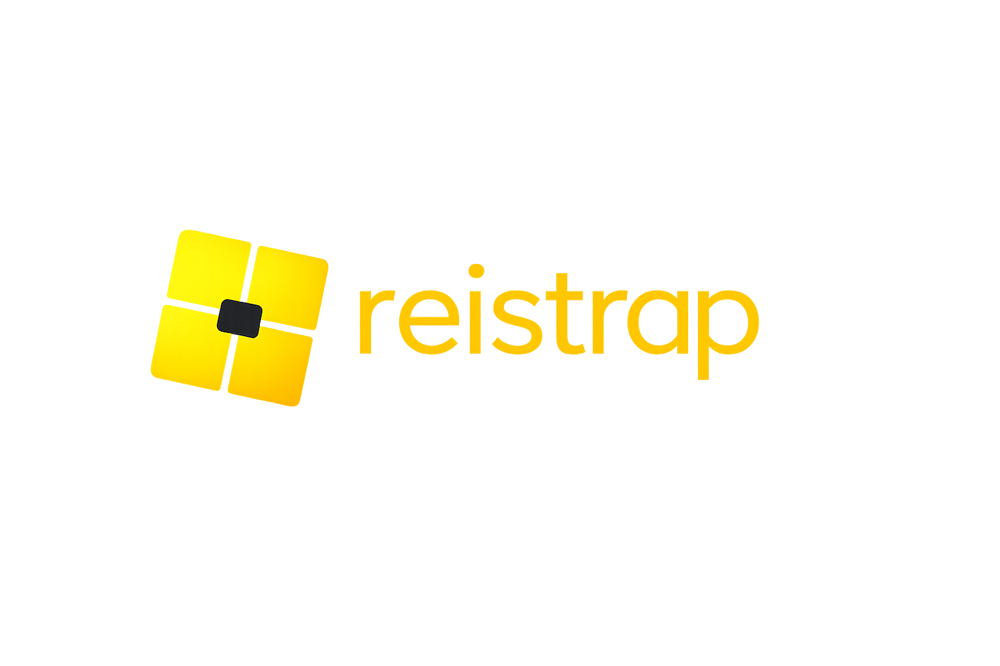

> [!IMPORTANT]
> **reistrap** is an independent, unofficial fork of the open-source project [Bloxstrap](https://github.com/bloxstraplabs/bloxstrap). It is not affiliated with, maintained by, or endorsed by the original Bloxstrap developers.

    
    

----

**reistrap** is a third-party replacement for the standard Roblox bootstrapper, providing additional useful features and improvements.

Running into a problem or need help with something? Check out the Wiki (not available). If you can't find anything, or would like to suggest something, please submit an issue.

**reistrap** is only supported for PCs running Windows.

## Frequently Asked Questions

**Q: Is this safe / malware-free?**

**A:** Yes. Just like the original project, reistrap is fully open-source. Every line of code is viewable right here on GitHub. However, because this is a third-party fork, **do not** seek support from the official Bloxstrap team if you encounter bugs. Please open an issue on this repository instead.

**Q: Can using this get me banned?**

**A:** No, it shouldn't. **reistrap** doesn't interact with the Roblox client in the same way that exploits do, and never will.
[Read more about that here.](https://bloxstraplabs.com/wiki/info/bloxstrap-and-bans)

## Features

- Hassle-free Discord Rich Presence to let your friends know what you're playing at a glance
- Simple support for modding of content files for customizability (death sound, mouse cursor, etc)
- See where your server is geographically located (courtesy of [ipinfo.io](https://ipinfo.io))
- Ability to configure graphics fidelity and UI experience

## Installing
Download the latest release of **reistrap**, and run it. Configure your preferences if needed, and install. That's about it!

You will also need the [.NET 6 Desktop Runtime](https://aka.ms/dotnet-core-applaunch?missing_runtime=true&arch=x64&rid=win11-x64&apphost_version=6.0.36&gui=true). If you don't already have it installed, you'll be prompted to install it anyway. Be sure to install **reistrap** after you've installed this.

It's not unlikely that Windows Smartscreen will show a popup when you run **reistrap** for the first time. This happens because it's an unknown program, not because it's actually detected as being malicious. To dismiss it, just click on "More info" and then "Run anyway".

Once installed, **reistrap** is added to your Start Menu, where you can access the menu and reconfigure your preferences if needed.

## Code

**reistrap** uses the [WPF UI](https://github.com/lepoco/wpfui) library for the user interface design.

## Code signing policy

Thanks to [SignPath.io](https://signpath.io/) for providing a free code signing service, and the [SignPath Foundation](https://signpath.org/) for providing the free code signing certificate.

    

## Code signing policy

Thanks to [SignPath.io](https://signpath.io/) for providing a free code signing service, and the [SignPath Foundation](https://signpath.org/) for providing the free code signing certificate.
